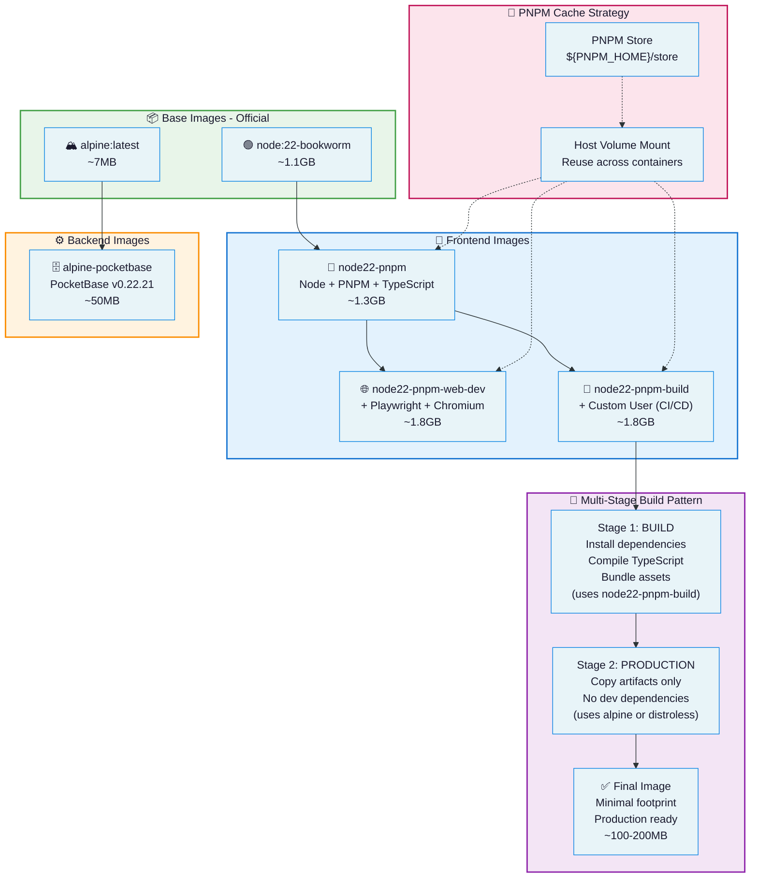

# Base images

This repo has the docker image definitions that I use on my dev container environments, CI/CD and Production services.

**The packages are published at: https://github.com/marcandreuf?tab=packages**

---

## Architecture

**Published packages:** [https://github.com/marcandreuf/base-images](https://github.com/marcandreuf/base-images)



*Ejemplo de multi-stage build para base images optimizadas, similar a mis Dockerfiles para Node.js y Pocketbase.*

### Image Hierarchy

| Stage | Purpose | Size Impact |
|-------|---------|-------------|
| **Base Image** | Official Node/Alpine | Starting point |
| **Build Stage** | Install deps, compile TS, bundle | Temporary (~1.8GB) |
| **Production Stage** | Copy only artifacts | Final (~100-200MB) |

---

# Backend

## 1. Pocketbase base: `backend/docker-alpine-pocketbase`

A dockerised solution for the [Pocketbase](https://pocketbase.io/) backend service. 
It is configured to run on port 8080 by default. 

### Build
```bash
docker build --progress=plain -t test-base-image-pocketbase -f backend/dockerfile-alpine-pocketbase .
```

### Run
This image can be configured to run on a specific port by re-defining the variable environment `VE_PB_PORT`.

```bash
# Run with default port
docker run --rm -it test-base-image-pocketbase:latest

# Run on custom port
docker run --rm -it -e VE_PB_PORT=8091 test-base-image-pocketbase:latest
```
<br/>


# Frontend


## 1. Docker Node 22 pnpm: `frontent/dockerfile-node22-pnpm`

This image has a basic node env setup with PNPM_HOME. This folder can be mounted ona docker compose file mapping the host PNPM_HOME folder and thus reusing all the pnpm cached packages to save disk space.

### Build
```bash
docker build --progress=plain -t test-base-image-node22-pnpm -f frontend/dockerfile-node22-pnpm .
```

### Run

```bash
docker run --rm -it test-base-image-node22-pnpm:latest /bin/bash
```

## 2. Docker Node 22 pnpm web dev: `frontent/dockerfile-node22-pnpm-web-dev`

This image expands the "frontend-node22-pnpm" image with [mermaid](https://mermaid.js.org/) deps to render mdx with mermaid diagrams on the server side.

### Build
```bash
docker build --progress=plain -t test-base-image-node22-pnpm-web-dev -f frontend/dockerfile-node22-pnpm-web-dev .
```

### Run

```bash
docker run --rm -it test-base-image-node22-pnpm-web-dev:latest /bin/bash
```


## 3. Docker Node 22 pnpm web dev: `frontent/dockerfile-node22-pnpm-build`

This image expands the "frontend-node22-pnpm-web-dev" with build args to customise the image to the user on the shared runner host machines in Github.

### Build
```bash
docker build --progress=plain -t test-base-image-node22-pnpm-build -f frontend/dockerfile-node22-pnpm-build .
```
**Custom builds**

```bash
# Github runs docker containers with the runner user with id 1001.
docker build --no-cache --progress=plain --build-arg USERNAME=node --build-arg HOST_UID=1000 --build-arg HOST_GID=1000 -t test-node22-pnpm-build -f frontend/dockerfile-node22-pnpm-build .

```

### Run

```bash
# Run with the default user `runner`
docker run --rm -it test-base-image-node22-pnpm-build:latest /bin/bash

# Run with custom node user
docker run --rm -it -u node test-base-image-node22-pnpm-build:latest /bin/bash
```

